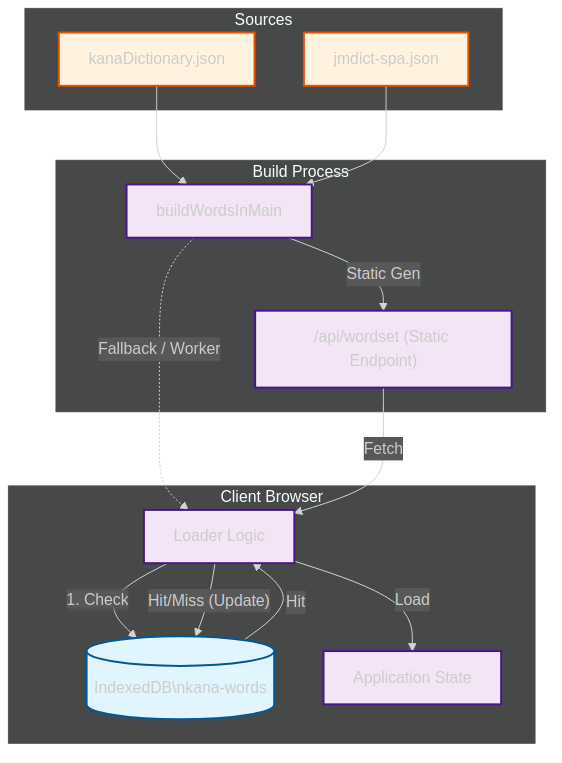

# Kana Words

Practice hiragana and katakana via romaji input with streaks, filters, and multilingual UI.

## Features
- Modes: Hiragana, Katakana, Both
- Filtering: character groups, word length
- Dynamic dictionary loading with IndexedDB cache (worker-based)
- i18n: English, Spanish, Japanese
- Sokuon rule support (small っ / ッ doubles the consonant)
- Persistent preferences (language, mode, filters)
- Shadcn-styled UI with keyboard-friendly flow

## Tech Stack
- Next.js (App Router) + React
- Bun runtime + bunx
- TypeScript, Tailwind CSS, shadcn/ui
- IndexedDB + Web Workers for word loading

## Getting Started
Install dependencies:
```bash
bun install
```

Run dev server:
```bash
bun dev
```

Build for production:
```bash
bun run build
```

Start production build:
```bash
bun start
```

## Data & Licensing
- Uses `data/jmdict-spa-3.6.1.json` from [jmdict-simplified](https://github.com/scriptin/jmdict-simplified) (tracked via Git LFS).
- Dictionary sources: JMdict/EDICT and KANJIDIC from the [Electronic Dictionary Research and Development Group](https://www.edrdg.org/), used per their [licence](https://www.edrdg.org/edrdg/licence.html).

## Datasets
### Words (kana/romaji)
- Source: JMdict simplified (see above).
- Build: filtered and normalized into `data/jmdict-spa-3.6.1.json` with language fields `meaning_en` and `meaning_es`, plus kana/romaji for practice.
- Storage: shipped via Git LFS; loaded lazily in the browser and cached in IndexedDB.

### Kanji
- Source: KANJIDIC (via jmdict-simplified repo).
- Build: filtered by JLPT levels (N5–N1) with readings and meanings; stored inline in `src/lib/kanji-data.ts`.
- Fields: `char`, `reading`, `meaning_en`, `meaning_es` (Spanish may be missing for some entries and will fall back to English), `jlpt`.
- Maintenance scripts (Bun):
  - Build dataset fallback pipeline (Jisho API + Playwright scrape):  
    ```bash
    bunx tsx scripts/build-kanjiset.ts
    ```
  - Report JLPT entries missing Spanish (configurable):  
    ```bash
    # defaults: --input data/kanjiset-v7.json --output data/kanjiset-missing-es.json --jlpt jlpt-n1
    bunx tsx scripts/report-n1-missing-es.ts --input data/kanjiset-v7.json --jlpt jlpt-n1 --output data/kanjiset-n1-missing-es.json
    ```
    - Interactive mode: if `--input`/`--output` are omitted, it will list detected `kanjiset-v*.json` files (latest default), prompt to choose, and auto-rename output to avoid overwrites.
  - Merge translated entries into a dataset (ID-based merge):  
    ```bash
    # defaults: --input data/kanjiset-v7.json --translations data/kanjiset-n1-missing-es.json --output data/kanjiset-v7-merged.json
    bunx tsx scripts/merge-n1-translations.ts --input data/kanjiset-v7.json --translations data/kanjiset-n1-missing-es.json --output data/kanjiset-v7-merged.json
    ```
    - Interactive mode: if args are omitted, it will list detected datasets and translation JSONs, pick the latest by default, and write to a non-overwriting `*-merged.json` (auto-suffixed if needed).

### Numbers & Dates
- Numbers: generated procedurally in-app; no external dataset.
- Dates: generated procedurally in-app; no external dataset.

## Data Architecture



### Word Data Pipeline
1. **Source**: Raw data comes from `kanaDictionary.json` (basic kana) and `jmdict-spa-3.6.1.json` (vocabulary).
2. **Build Process**: 
   - Primary: Static Generation via `/api/wordset`. The `buildWordsInMain` function merges dictionary definitions with character groups.
   - Fallback: Client-side generation ensures functionality even if the API fails.
3. **Caching Strategy**:
   - Browser: Data is cached in **IndexedDB** (`kana-words` db, `wordSets` store).
   - Validation: Cache versioning (`v1-prod-{lang}`) prevents stale data usage.
   - Lifecycle: App checks IndexedDB -> Fetches API -> Falls back to local generation -> Updates Cache.

### Kanji System
- **Static Storage**: Core N5-N1 data is pre-compiled into `src/lib/kanji-data.ts` for instant load.
- **Enrichment**:
  - Scripts (`scripts/build-kanjiset.ts`) fetch missing data from external APIs (Jisho) and scrape supplemental info.
  - Translation merging scripts (`scripts/merge-n1-translations.ts`) allow collaborative translation updates.

## Deployment
The app is deployed on Vercel. To deploy:
```bash
vercel --prod
```
