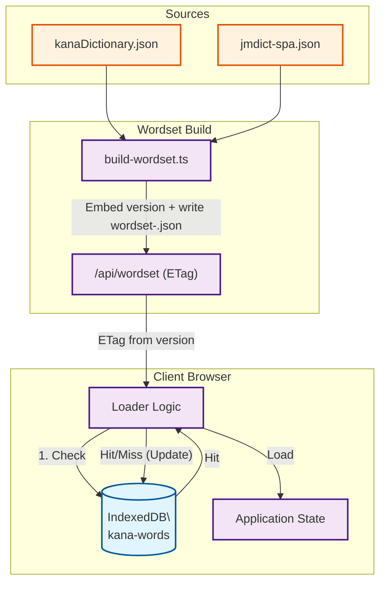

# Japanese Practice (日本語練習)

A comprehensive web application for practicing Japanese language skills including hiragana, katakana, kanji, numbers, and dates with an intuitive, multilingual interface.

## 🎮 Game Modes

### Words Game
Practice reading and writing Japanese words in hiragana and katakana:
- **Dictionary Mode**: Learn real Japanese vocabulary with translations
- **Character Mode**: Practice random character combinations
- **Custom Settings**: Filter by character groups, word length (3-6 default), and kana type
- **Particle Support**: Handles は as "wa" particle
- **Sokuon Rules**: Correctly processes small っ/ッ (doubles consonants)

### Kanji Game
Master Japanese kanji characters:
- **JLPT Levels**: Practice N5 through N1 kanji
- **Difficulty Modes**: Adaptive difficulty based on your level
- **Readings & Meanings**: Learn both readings and English/Spanish meanings
- **IndexedDB Caching**: Fast loading with intelligent caching

### Numbers Game
Learn Japanese number pronunciation:
- **Interactive Keypad**: Shuffle option for varied practice
- **Multiple Ranges**: Practice different number sets
- **Audio Support**: Hear correct pronunciations

### Dates Game
Practice Japanese date expressions:
- **Days, Months, Years**: Comprehensive date practice
- **Hybrid Week Days Mode**: Mixed practice scenarios
- **Real-world Context**: Learn practical date usage

## ✨ Features

- **🌍 Multilingual**: Full i18n support (English, Spanish, Japanese)
- **🎯 Session & Infinite Modes**: Practice with goals or endlessly
- **📊 Progress Tracking**: Track your streaks and performance
- **🎨 Modern UI**: Beautiful interface with shadcn/ui components
- **🌓 Theme Support**: Light and dark mode
- **📱 Responsive**: Optimized for mobile and desktop
- **⚡ Performance**: IndexedDB caching, Web Workers, ETag optimization
- **🔄 Smart Caching**: Efficient data loading and versioning
- **📈 Analytics**: Integrated Vercel Analytics and Speed Insights

## 🛠️ Tech Stack

- **Framework**: Next.js 16 (App Router) + React 19
- **Runtime**: Bun
- **Language**: TypeScript (strict mode)
- **Styling**: Tailwind CSS 4 + shadcn/ui
- **Data**: IndexedDB + Web Workers
- **Testing**: Bun Test + Playwright + React Testing Library
- **CI/CD**: GitHub Actions + Semantic Release
- **Deployment**: Vercel

## 🚀 Getting Started

### Prerequisites
- [Bun](https://bun.sh/) installed on your system

### Installation

```bash
# Install dependencies
bun install
```

### Development

```bash
# Run dev server
bun dev
```

Visit [http://localhost:3000](http://localhost:3000)

### Production

```bash
# Build for production
bun run build

# Start production server
bun start
```

## 🧪 Testing

This project uses a comprehensive testing strategy with both unit and E2E tests.

### Unit Tests

```bash
# Run all unit tests
bun test

# Run unit tests in watch mode
bun test --watch

# Run specific test file
bun test src/lib/game-registry.test.ts
```

**Framework**: Bun Test + React Testing Library + happy-dom

**Guidelines**:
- Focus on user interactions, not implementation details
- Use React Testing Library queries (`getByRole`, `getByText`, etc.)
- Test behavior, not internals
- No conditionals in tests

See [TESTING.md](TESTING.md) for detailed testing guidelines.

### E2E Tests

```bash
# Run all E2E tests
bun run test:e2e

# Run E2E tests with UI
bun run test:e2e:ui

# Run E2E tests in headed mode
bun run test:e2e:headed

# Debug E2E tests
bun run test:e2e:debug
```

**Framework**: Playwright

**Coverage**:
- ✅ Words Game (comprehensive UI and interaction tests)
- ✅ Numbers Game
- ✅ Dates Game
- 📸 Visual documentation with screenshots

E2E tests verify critical user flows including game interactions, settings changes, mode switching, and feedback mechanisms.

### Pre-commit Hooks

The project uses Husky for Git hooks:
- **Pre-push**: Runs unit tests and builds wordset to ensure code quality

## 🔄 CI/CD

### Automated Releases

This project uses [semantic-release](https://github.com/semantic-release/semantic-release) for automated versioning and changelog generation.

**Commit Convention**: [Conventional Commits](https://www.conventionalcommits.org/)

```bash
# Examples
feat: add new game mode
fix: correct romaji conversion
docs: update README
```

**Release Process**:
1. Push commits following conventional format
2. GitHub Actions runs tests and builds
3. Semantic-release analyzes commits
4. Automatically generates version, CHANGELOG, and GitHub release

### GitHub Actions

- **CI**: Runs on every push and PR
- **Release**: Automated releases on main branch
- **Tests**: Unit and E2E tests in CI pipeline

## Data & Licensing
- Uses `data/jmdict-spa-3.6.1.json` from [jmdict-simplified](https://github.com/scriptin/jmdict-simplified) (tracked via Git LFS).
- Dictionary sources: JMdict/EDICT and KANJIDIC from the [Electronic Dictionary Research and Development Group](https://www.edrdg.org/), used per their [licence](https://www.edrdg.org/edrdg/licence.html).

## Datasets
### Words (kana/romaji)
- Source: JMdict simplified (see above).
- Build: filtered and normalized into `data/jmdict-spa-3.6.1.json` with language fields `meaning_en` and `meaning_es`, plus kana/romaji for practice.
- Storage: shipped via Git LFS; loaded lazily in the browser and cached in IndexedDB.
- **Distribution:** Wordsets ship as `public/wordset-<lang>.json` (no version suffix in filename). Each file embeds a numeric `version`, which the API surfaces via ETag for cache invalidation.

### Kanji
- Source: KANJIDIC (via jmdict-simplified repo).
- Build: filtered by JLPT levels (N5–N1) with readings and meanings; stored inline in `src/lib/kanji-data.ts`.
- Fields: `char`, `reading`, `meaning_en`, `meaning_es` (Spanish may be missing for some entries and will fall back to English), `jlpt`.
- Maintenance scripts (Bun):
  - Build dataset fallback pipeline (Jisho API + Playwright scrape):  
    ```bash
    bunx tsx scripts/build-kanjiset.ts
    ```
  - Report JLPT entries missing Spanish (configurable):  
    ```bash
    # defaults: --input data/kanjiset-v7.json --output data/kanjiset-missing-es.json --jlpt jlpt-n1
    bunx tsx scripts/report-n1-missing-es.ts --input data/kanjiset-v7.json --jlpt jlpt-n1 --output data/kanjiset-n1-missing-es.json
    ```
    - Interactive mode: if `--input`/`--output` are omitted, it will list detected `kanjiset-v*.json` files (latest default), prompt to choose, and auto-rename output to avoid overwrites.
  - Merge translated entries into a dataset (ID-based merge):  
    ```bash
    # defaults: --input data/kanjiset-v7.json --translations data/kanjiset-n1-missing-es.json --output data/kanjiset-v7-merged.json
    bunx tsx scripts/merge-n1-translations.ts --input data/kanjiset-v7.json --translations data/kanjiset-n1-missing-es.json --output data/kanjiset-v7-merged.json
    ```
    - Interactive mode: if args are omitted, it will list detected datasets and translation JSONs, pick the latest by default, and write to a non-overwriting `*-merged.json` (auto-suffixed if needed).

### Numbers & Dates
- Numbers: generated procedurally in-app; no external dataset.
- Dates: generated procedurally in-app; no external dataset.

## Data Architecture

### Wordset Delivery (v2)



Rendered image: `docs/diagrams/data-flow.png` (source in `docs/diagrams/data-flow.mmd`).

### Word Data Pipeline
1. **Sources**: `kanaDictionary.json` (kana groups) and `jmdict-spa-3.6.1.json` / `jmdict-eng-3.6.2.json` (vocabulary).
2. **Build Process**: `scripts/build-wordset.ts` merges sources, filters blacklist, embeds `version`, and writes `public/wordset-<lang>.json` (ES and EN variants).
3. **API Delivery**: `/api/wordset?lang=<lang>` reads the embedded `version`, sets `ETag`, and serves JSON. Clients validate with `If-None-Match` for lightweight 304 responses.
4. **Caching**:
   - Browser: IndexedDB (`kana-words` db, `wordSets` store) stores the latest wordset per language.
   - Lifecycle: Check IndexedDB → Fetch API (ETag) → Fallback to local generation if needed → Update cache.

### Kanji System
- **Static Storage**: Core N5-N1 data is pre-compiled into `src/lib/kanji-data.ts` for instant load.
- **Enrichment**:
  - Scripts (`scripts/build-kanjiset.ts`) fetch missing data from external APIs (Jisho) and scrape supplemental info.
  - Translation merging scripts (`scripts/merge-n1-translations.ts`) allow collaborative translation updates.

## 🚀 Deployment

The application is deployed on [Vercel](https://vercel.com).

### Deploy to Vercel

```bash
# Deploy to production
vercel --prod
```

**Features**:
- ✅ Automatic deployments from main branch
- ✅ Preview deployments for PRs
- ✅ Edge network for global performance
- ✅ Analytics and Speed Insights integrated

### Environment Variables

Create a `.env.local` file for local development (see `.env.local` in the project for required variables).

## 📚 Scripts

```bash
# Development
bun dev                    # Start dev server

# Building
bun run build             # Build for production
bun start                 # Start production server

# Testing
bun test                  # Run unit tests
bun run test:unit         # Run unit tests (explicit)
bun run test:e2e          # Run E2E tests
bun run test:e2e:ui       # Run E2E tests with UI
bun run test:e2e:debug    # Debug E2E tests

# Data Generation
bun run wordset:build     # Build word datasets
bun run kanji:build       # Build kanji dataset

# Code Quality
bun run lint              # Run ESLint
```

## 🤝 Contributing

Contributions are welcome! Please follow these guidelines:

1. **Commits**: Use [Conventional Commits](https://www.conventionalcommits.org/)
   - `feat:` for new features
   - `fix:` for bug fixes
   - `docs:` for documentation
   - `test:` for tests
   - `refactor:` for refactoring

2. **Testing**: 
   - Write tests for new features
   - Ensure all tests pass before pushing
   - Follow React Testing Library best practices

3. **Code Quality**:
   - Use TypeScript strict mode
   - Avoid `any` types
   - Follow the Boy Scout Rule: leave code cleaner than you found it

4. **Git Hooks**: Pre-push hooks will run tests automatically

## 📄 License

This project uses data from:
- [JMdict/EDICT](https://www.edrdg.org/jmdict/j_jmdict.html) - Japanese-Multilingual Dictionary
- [KANJIDIC](https://www.edrdg.org/wiki/index.php/KANJIDIC_Project) - Kanji Dictionary

Both are provided by the [Electronic Dictionary Research and Development Group](https://www.edrdg.org/) under their [license](https://www.edrdg.org/edrdg/licence.html).

## 🙏 Acknowledgments

- Dictionary data from [jmdict-simplified](https://github.com/scriptin/jmdict-simplified)
- UI components from [shadcn/ui](https://ui.shadcn.com/)
- Icons from [Lucide](https://lucide.dev/)

---

**Current Version**: 2.0.0

For detailed changes, see [CHANGELOG.md](CHANGELOG.md)

