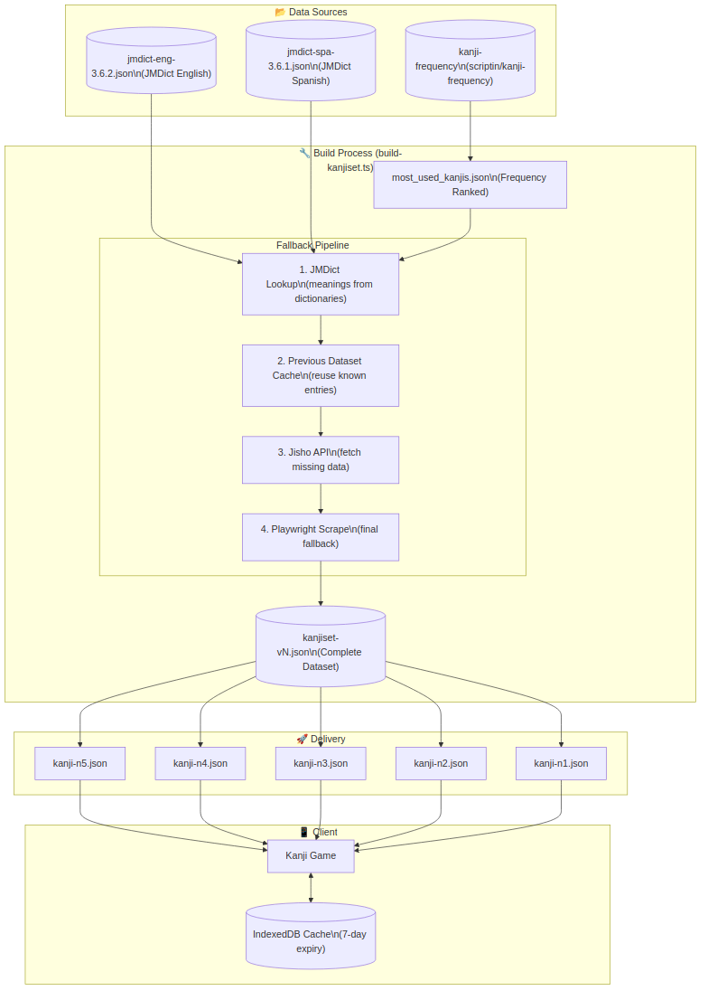

# Japanese Practice (日本語練習)

Practice kana, vocabulary, kanji, numbers, and dates with short sessions or unlimited play. Review missed questions, save your settings, and learn on mobile or desktop in English, Spanish, or Japanese.

## 🎮 Game Modes

- **Words**: Type romaji for hiragana/katakana vocabulary or generated characters, or choose a reading in Guess mode. Custom filters select kana groups and length. A five-question hiragana preset helps beginners start quickly.
- **Kanji**: Choose readings and see English/Spanish meanings. Difficulty selects N5, N5–N3, or N5–N1 question pools.
- **Numbers**: Convert between Arabic numerals and Japanese kanji with an interactive keypad and four difficulty ranges.
- **Dates**: Practice weekday, month, and full month/day readings in hiragana or romaji.

## ✨ Features

- **Focused practice**: Shared settings with Save/Cancel, completed-question progress, clear answer feedback, and session summaries across all four games.
- **Missed-question review**: Replay unique incorrect or skipped questions after a finite session, then restart or switch to unlimited practice.
- **Saved preferences**: Keep validated practice configurations locally and start a fresh session with “Practice again.”
- **Multilingual interface**: English, Spanish, and Japanese, with eight light/dark theme palettes.
- **Responsive controls**: Mobile settings sheets, desktop dialogs, visible keyboard focus, and reduced-motion support.
- **Reliable vocabulary downloads**: Immutable static wordsets, checksum validation, IndexedDB caching, mobile consent, and recovery that preserves existing cached data.
- **Progress tracking**: Session accuracy, score, streak, and best streak.

The application centers on these four practice games. The experimental Ollama quiz subsystem has been removed.

## 🛠️ Tech Stack

- **Framework**: Next.js 16 (App Router) + React 19
- **Runtime**: Bun
- **Language**: TypeScript (strict mode)
- **Styling**: Tailwind CSS 4 + shadcn/ui
- **Data**: Static JSON assets + IndexedDB; procedural numbers and dates
- **Testing**: Bun Test + Playwright + React Testing Library
- **CI/CD**: GitHub Actions + Semantic Release
- **Deployment**: Vercel

## 🚀 Getting Started

### Prerequisites
- [Bun](https://bun.sh/) installed on your system

### Installation

```bash
# Install dependencies
bun install
```

### Development

```bash
# Run dev server
bun dev
```

Visit [http://localhost:3000](http://localhost:3000)

### Production

```bash
# Build for production
bun run build

# Start production server
bun start
```

## 🧪 Testing

This project uses a comprehensive testing strategy with both unit and E2E tests.

### Unit Tests

```bash
# Run all unit tests
bun test src

# Run unit tests in watch mode
bun test --watch src

# Run specific test file
bun test src/lib/core/__tests__/game-registry.test.ts
```

**Framework**: Bun Test + React Testing Library + happy-dom

**Guidelines**:
- Focus on user interactions, not implementation details
- Use React Testing Library queries (`getByRole`, `getByText`, etc.)
- Test behavior, not internals
- No conditionals in tests

See [TESTING.md](TESTING.md) for detailed testing guidelines.

### E2E Tests

```bash
# Run all E2E tests
bun run test:e2e

# Run E2E tests with UI
bun run test:e2e:ui

# Run E2E tests in headed mode
bun run test:e2e:headed

# Debug E2E tests
bun run test:e2e:debug
```

**Framework**: Playwright

**Coverage**:
- ✅ Words Game (comprehensive UI and interaction tests)
- ✅ Numbers Game
- ✅ Dates Game
- ✅ Kanji Game
- ✅ Saved settings, missed-item review, and vocabulary download/recovery
- 📸 Visual documentation with screenshots

E2E tests verify critical user flows including game interactions, settings changes, mode switching, and feedback mechanisms.

### Git Hooks

The project uses Husky for Git hooks:
- **Pre-push**: Runs typecheck, lint, unit tests, the production build, and wordset generation (CI skips the last two).

## 🔄 CI/CD

### Automated Releases

This project uses [semantic-release](https://github.com/semantic-release/semantic-release) for automated versioning and changelog generation.

**Commit Convention**: [Conventional Commits](https://www.conventionalcommits.org/)

```bash
# Examples
feat: add new game mode
fix: correct romaji conversion
docs: update README
```

**Release Process**:
1. Merge feature and refactor PRs into `develop`.
2. Create a `release/*` branch from `develop`, incorporate current `main`, and open a PR against `main`.
3. Verify CI and review the release before merging.
4. On the merge to `main`, semantic-release analyzes Conventional Commits and updates the version, CHANGELOG, tag, and GitHub release. Do not manually bump the release version in the PR.

### GitHub Actions

- **CI**: Runs on every push and PR
- **Release**: Automated releases on main branch
- **Tests**: Unit and E2E tests in CI pipeline

## Data & Licensing
- Uses `data/jmdict-spa-3.6.1.json` from [jmdict-simplified](https://github.com/scriptin/jmdict-simplified) (tracked via Git LFS).
- Dictionary sources: JMdict/EDICT and KANJIDIC from the [Electronic Dictionary Research and Development Group](https://www.edrdg.org/), used per their [licence](https://www.edrdg.org/edrdg/licence.html).

## Datasets
### Words (kana/romaji)
- Source: JMdict simplified (see above).
- Build: `scripts/build-wordset.ts` filters dictionary sources into `public/wordset-en.json` and `public/wordset-es.json` with kana, romaji, and localized vocabulary meanings.
- Storage: source dictionaries are tracked with Git LFS; generated wordsets load lazily as static assets and persist in IndexedDB.
- **Distribution:** Builds publish immutable `/wordsets/<lang>-<sha256>.json` assets and a small revalidated `/wordsets/manifest.json`. See [the artifact and deployment contract](docs/static-wordsets.md).

### Kanji
- **Frequency Source**: [kanji-frequency](https://github.com/scriptin/kanji-frequency) by scriptin - provides frequency-ranked kanji based on newspaper corpus analysis.
- **Metadata Source**: KANJIDIC (via jmdict-simplified repo) + Jisho API for readings, meanings, and JLPT levels.
- **Build Process**: `scripts/build-kanjiset.ts` creates the complete dataset:
  1. Checks previous dataset cache to reuse known entries (meanings, readings, JLPT)
  2. Loads `data/most_used_kanjis.json` (frequency-ranked list from kanji-frequency)
  3. Loads JMdict English/Spanish dictionaries for meanings
  4. Fetches missing data from [Jisho API](https://jisho.org/api/v1/search/words) with throttling
  5. Uses Playwright to scrape Jisho pages as final fallback for stubborn entries
  6. Outputs versioned `public/kanjiset-vN.json` with all enriched data
- **Fields**: `char`, `reading`, `meaning_en`, `meaning_es`, `jlpt`, `rank` (frequency rank)
- **Delivery**: Split by JLPT level into `public/kanji-n1.json` through `public/kanji-n5.json` for lazy loading
- **Storage**: Loaded lazily per JLPT level and cached in IndexedDB with 7-day expiry

**Maintenance scripts (Bun)**:
  - Build dataset with fallback pipeline (Jisho API + Playwright scrape):  
    ```bash
    bunx tsx scripts/build-kanjiset.ts
    ```
  - Report JLPT entries missing Spanish (configurable):  
    ```bash
    bunx tsx scripts/report-n1-missing-es.ts --input data/kanjiset-v7.json --jlpt jlpt-n1 --output data/kanjiset-n1-missing-es.json
    ```
  - Merge translated entries into a dataset (ID-based merge):  
    ```bash
    bunx tsx scripts/merge-n1-translations.ts --input data/kanjiset-v7.json --translations data/kanjiset-n1-missing-es.json --output data/kanjiset-v7-merged.json
    ```

### Numbers & Dates
- Numbers: generated procedurally in-app; no external dataset.
- Dates: generated procedurally in-app; no external dataset.

## Application Architecture

- **Pages** compose the four practice routes using shared layouts, settings, feedback, and progress components.
- **Game hooks** manage question/input lifecycles; a shared session reducer admits outcomes once and owns scoring, streaks, and completion. Review queues retain typed missed questions for finite sessions.
- **Practice domain modules** handle selection, character generation, romaji conversion, and answer evaluation separately from React state.
- **Dataset services** own consent, transport, integrity checks, durable storage, shared requests, and refresh recovery independently of gameplay.
- **Preference hooks** initialize from validated browser storage and keep active sessions stable through hydration and external preference updates.
- **Boundary checks** enforce the public imports between these areas with `bun run check:boundaries`.

See [Words module boundaries](docs/words-module-boundaries.md), [static wordset delivery](docs/static-wordsets.md), and [desktop/mobile visual evidence](specs/2026-09-05-practice-ux/visuals/README.md).

## Data Architecture

### Word Data Pipeline
1. **Sources**: `kanaDictionary.json` (kana groups) and `jmdict-spa-3.6.1.json` / `jmdict-eng-3.6.2.json` (vocabulary).
2. **Dataset build**: `scripts/build-wordset.ts` filters and merges sources into versioned payloads in `public/wordset-<lang>.json`.
3. **Static publication**: `scripts/publish-wordsets.ts` validates both languages and emits exact-byte, SHA-256-named assets and a small metadata manifest during dev and production builds.
4. **Acquisition**: Check IndexedDB, then revalidate manifest metadata. Download only a changed or missing asset; verify its size, checksum, version and word shape before durable persistence. Mobile downloads require consent, and failed refreshes preserve cached data.

### Kanji Data Pipeline



**Pipeline Details**:
- **Static Storage**: Core N5-N1 data is pre-compiled into `public/kanji-n*.json` for lazy loading by JLPT level.
- **Enrichment**:
  - Scripts (`scripts/build-kanjiset.ts`) fetch missing data from external APIs (Jisho) and scrape supplemental info.
  - Translation merging scripts (`scripts/merge-n1-translations.ts`) allow collaborative translation updates.
- **Caching**: Browser caches kanji data in IndexedDB with 7-day expiry per JLPT level.

## 🚀 Deployment

The application is deployed on [Vercel](https://vercel.com).

### Deploy to Vercel

```bash
# Deploy to production
vercel --prod
```

**Features**:
- ✅ Automatic deployments from main branch
- ✅ Preview deployments for PRs
- ✅ Edge network for global performance
- ✅ Analytics and Speed Insights integrated

### Environment Variables

Create a `.env.local` file for local development (see `.env.local` in the project for required variables).

## 📚 Scripts

```bash
# Development
bun dev                    # Start dev server

# Building
bun run build             # Build for production
bun start                 # Start production server

# Testing
bun test src              # Run unit tests
bun run test:unit         # Run unit tests (explicit)
bun run test:e2e          # Run E2E tests
bun run test:e2e:ui       # Run E2E tests with UI
bun run test:e2e:debug    # Debug E2E tests

# Data Generation
bun run wordset:build     # Build word datasets
bun run kanji:build       # Build kanji dataset

# Code Quality
bun run lint              # Run ESLint
bun run typecheck         # Check TypeScript
bun run check:boundaries  # Verify feature boundaries
```

## 🤝 Contributing

Contributions are welcome! Please follow these guidelines:

1. **Commits**: Use [Conventional Commits](https://www.conventionalcommits.org/)
   - `feat:` for new features
   - `fix:` for bug fixes
   - `docs:` for documentation
   - `test:` for tests
   - `refactor:` for refactoring

2. **Testing**: 
   - Write tests for new features
   - Ensure all tests pass before pushing
   - Follow React Testing Library best practices

3. **Code Quality**:
   - Use TypeScript strict mode
   - Avoid `any` types
   - Follow the Boy Scout Rule: leave code cleaner than you found it

4. **Git Hooks**: Pre-push hooks will run tests automatically

## 📄 License

This project uses data from:
- [JMdict/EDICT](https://www.edrdg.org/jmdict/j_jmdict.html) - Japanese-Multilingual Dictionary
- [KANJIDIC](https://www.edrdg.org/wiki/index.php/KANJIDIC_Project) - Kanji Dictionary

Both are provided by the [Electronic Dictionary Research and Development Group](https://www.edrdg.org/) under their [license](https://www.edrdg.org/edrdg/licence.html).

## 🙏 Acknowledgments

- Dictionary data from [jmdict-simplified](https://github.com/scriptin/jmdict-simplified)
- Kanji frequency data from [kanji-frequency](https://github.com/scriptin/kanji-frequency)
- UI components from [shadcn/ui](https://ui.shadcn.com/)
- Icons from [Lucide](https://lucide.dev/)

For detailed changes, see [CHANGELOG.md](CHANGELOG.md)

